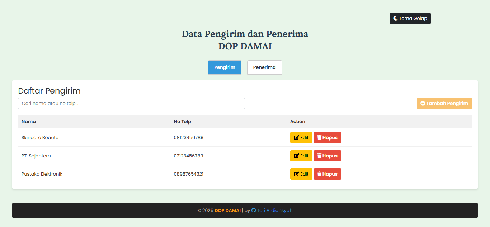
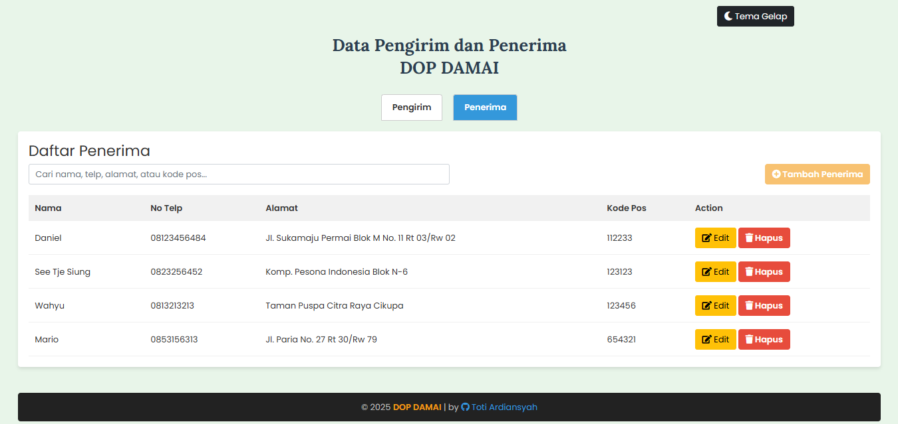
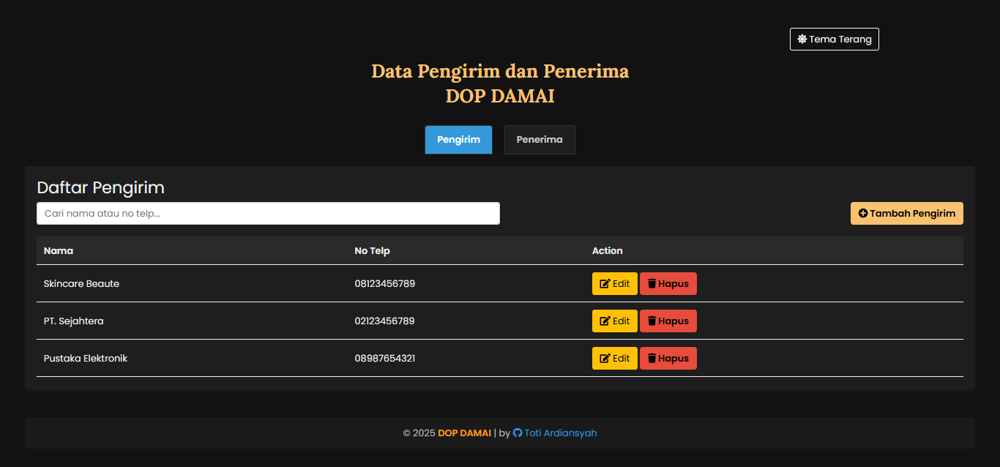
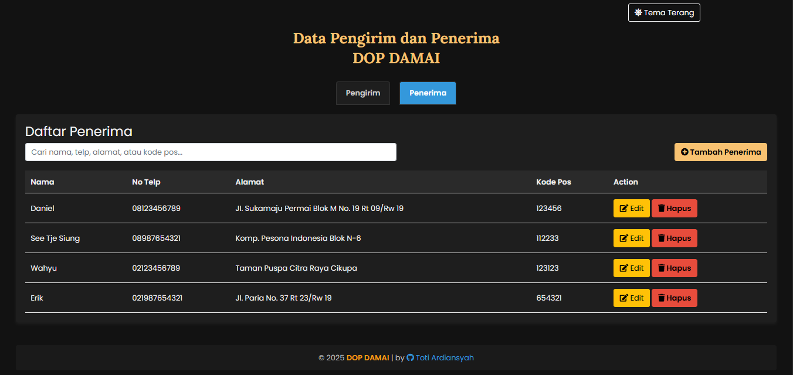

# dop-damai  
# 📦 Data Pengirim & Penerima - DOP DAMAI

Aplikasi web sederhana untuk mengelola data pengirim dan penerima menggunakan **PHP + MySQL**.  
Tampilan modern dengan **Bootstrap 5**, pencarian real-time, serta dukungan **mode terang & gelap**.

---

## ✨ Fitur

- ✅ Tambah, edit, hapus data **Pengirim** (nama, no telp)
- ✅ Tambah, edit, hapus data **Penerima** (nama, no telp, alamat, kode pos)
- 🔍 **Realtime search** untuk memfilter data secara langsung saat mengetik
- 🧠 Tab navigasi otomatis menyimpan posisi aktif (Pengirim/Penerima)
- 💻 Responsive UI dengan Bootstrap 5
- 🌓 **Dukungan mode terang & gelap**, masing-masing untuk tab Pengirim & Penerima
- 💡 Clean UI & UX friendly

---

## 🖼 Tampilan

| Mode | Pengirim | Penerima |
|------|----------|----------|
| **Terang** |  |  |
| **Gelap** |  |  |

> 📸 Pastikan folder `/screenshots` berisi keempat tampilan agar dokumentasi lebih menarik dan informatif.

---

## 🛠 Teknologi

- PHP 7+
- MySQL
- Bootstrap 5
- Font Awesome
- Google Fonts (Poppins & Lora)
- Vanilla JavaScript
- CSS Custom Properties (untuk tema terang & gelap)

---

## ⚙️ Cara Menjalankan

1. **Clone repository:**
    ```bash
    git clone https://github.com/totiard/dop-damai.git
    cd dop-damai
    ```

2. **Import database:**
    - Buat database baru dengan nama `dop_damai`
    - Import file SQL yang sudah disediakan:
      ```bash
      mysql -u root -p dop_damai < dop_damai.sql
      ```

    📁 File `dop_damai.sql` tersedia di folder utama proyek.

3. **Konfigurasi koneksi database:**
    - Buka file `index.php` dan sesuaikan bagian berikut:
      ```php
      $host = 'localhost';
      $user = 'root';
      $password = '';
      $dbname = 'dop_damai';
      ```

4. **Jalankan proyek di localhost:**
    - Jalankan XAMPP, Laragon, atau MAMP
    - Akses melalui browser:
      ```
      http://localhost/dop-damai
      ```

---

## 🙌 Kontribusi

Kontribusi sangat terbuka untuk siapa saja!  
Silakan fork repo ini, buat pull request, atau buka issue untuk fitur baru, perbaikan bug, atau saran peningkatan.

---

## 👤 Author

**Toti Ardiansyah**  
🔗 [GitHub](https://github.com/totiard) | [Portfolio](https://totiard.github.io/Profile-New)

---

## 📄 Lisensi

MIT License – Silakan gunakan, modifikasi, dan distribusikan proyek ini dengan bebas 🚀
