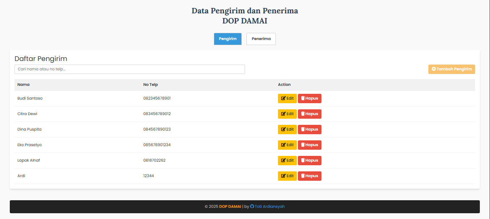
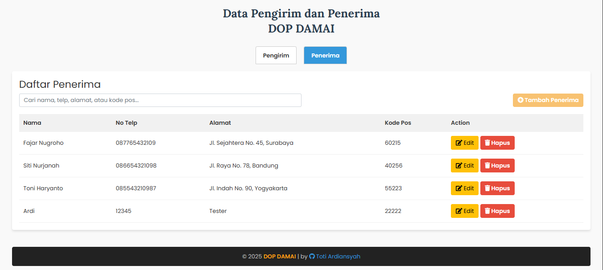

# dop-damai
# 📦 Data Pengirim & Penerima - DOP DAMAI

Aplikasi web sederhana untuk mengelola data pengirim dan penerima menggunakan **PHP + MySQL**.  
Tampilan modern menggunakan **Bootstrap 5** dan interaksi real-time untuk pencarian data.

---

## ✨ Fitur

- ✅ Tambah, edit, hapus data **Pengirim** (nama, no telp)
- ✅ Tambah, edit, hapus data **Penerima** (nama, no telp, alamat, kode pos)
- 🔍 **Realtime search** untuk memfilter data secara langsung saat mengetik
- 🧠 Tab navigasi otomatis menyimpan posisi aktif (Pengirim/Penerima)
- 💻 Responsive UI dengan Bootstrap
- 💡 Clean UI & UX friendly

---

## 🖼 Tampilan

| Pengirim Tab | Penerima Tab |
|--------------|--------------|
|  |  |

> 📸 Tambahkan folder `/screenshots` dan upload hasil tampilan kamu di dalamnya biar README lebih hidup!

---

## 🛠 Teknologi

- PHP 7+
- MySQL
- Bootstrap 5
- Font Awesome
- Google Fonts (Poppins & Lora)
- Vanilla JS

---

## ⚙️ Cara Menjalankan

1. **Clone repository:**
    ```bash
    git clone https://github.com/username/nama-project.git
    cd nama-project
    ```

2. **Import database:**
    - Buat database `dop_damai`
    - Import file SQL (buat dan sesuaikan sendiri jika belum ada)

3. **Konfigurasi koneksi database:**
    - Buka file `index.php`
    - Sesuaikan variabel di bagian atas:
      ```php
      $host = 'localhost';
      $user = 'root';
      $password = '';
      $dbname = 'dop_damai';
      ```

4. **Jalankan project di localhost:**
    - Jalankan server lokal seperti XAMPP, Laragon, atau MAMP
    - Akses di browser: `http://localhost/nama-folder-project`

---

## 🙌 Kontribusi

Proyek ini masih dikembangkan secara pribadi, tapi kontribusi tetap terbuka!  
Silakan fork, pull request, atau buat issue untuk fitur baru / perbaikan.

---

## 👤 Author

**Toti Ardiansyah**  
🔗 [GitHub](https://github.com/totiard) | [Portfolio](https://totiard.github.io/Profile-New)

---

## 📄 Lisensi

MIT License - Silakan gunakan, modifikasi, dan kembangkan sesuai kebutuhanmu 🚀
